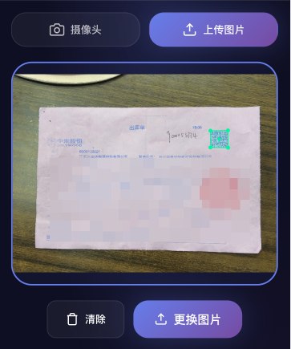

# 超强自动定位识别二维码工具 / Super QR Locator

精准定位图像中的二维码位置，自动截取并解码。  
Precisely locate QR codes in images, auto-crop and decode.

## 中文

### 项目简介
本项目是一个基于浏览器的二维码定位与解码工具，支持摄像头拍照与图片上传两种模式。检测与解码均在本地完成，不上传图片。

### 项目预览


### 功能亮点
- 多策略定位二维码，标记四角与中心点
- 自动截取二维码区域并尝试解码内容
- 摄像头拍照与拖拽/上传图片双模式
- 结果可视化与一键复制解码内容

### 强大之处
- 检测与解码双引擎：OpenCV.js 负责定位与校验，jsQR 作为补充解码
- 多种预处理策略轮询，提高复杂场景与低对比度图像的识别成功率
- 自动裁剪 + 透视校正 + 放大解码，最大化还原二维码细节
- 全程本地处理，图片不上传，隐私更安全

### 技术栈
- Vue 2 + Vue CLI
- OpenCV.js（二维码定位与校验解码）
- jsQR（解码补充）

### 构建与开发
1) 安装依赖
```bash
npm install
```

2) 本地开发（HTTPS，便于调用摄像头）
```bash
npm run dev
```

3) 生产构建（输出到 `dist/`）
```bash
npm run build
```

### 部署教程
构建产物是纯静态文件，可部署到任意静态服务器或平台。

1) 本地预览 `dist/`
```bash
npx serve dist
```

2) Nginx 示例（SPA 回退）
```nginx
server {
  listen 80;
  server_name your-domain.com;

  root /path/to/qrcode/dist;
  index index.html;

  location / {
    try_files $uri $uri/ /index.html;
  }
}
```

3) HTTPS 要求
- 摄像头与剪贴板 API 需要 HTTPS 或 `localhost`
- OpenCV.js 从 CDN 加载，请确保部署环境可访问 `https://docs.opencv.org`

### 注意事项
- 解码能力与图片清晰度、二维码完整性有关
- 若部署在子路径下，请调整 `vue.config.js` 的 `publicPath`

## English

### Overview
Browser-based QR locator and decoder with two modes: camera capture and image upload. All processing runs locally in the browser; no image is uploaded.

### Screenshot


### Highlights
- Multi-strategy QR detection with corner/center markers
- Auto-crop the QR area and try decoding
- Camera capture and drag-and-drop upload
- Visual result overlay and one-click copy

### Why It’s Powerful
- Dual engines: OpenCV.js for detection/validation, jsQR as a decode fallback
- Multi-step preprocessing to improve detection in low-contrast or noisy images
- Auto-crop + perspective warp + upscaling to maximize decoding success
- 100% local processing, no image upload for better privacy

### Tech Stack
- Vue 2 + Vue CLI
- OpenCV.js (detection + validation decode)
- jsQR (decode fallback)

### Build & Run
1) Install dependencies
```bash
npm install
```

2) Dev server (HTTPS for camera access)
```bash
npm run dev
```

3) Production build (outputs to `dist/`)
```bash
npm run build
```

### Deployment
The build output is static and can be hosted anywhere.

1) Preview locally
```bash
npx serve dist
```

2) Nginx example (SPA fallback)
```nginx
server {
  listen 80;
  server_name your-domain.com;

  root /path/to/qrcode/dist;
  index index.html;

  location / {
    try_files $uri $uri/ /index.html;
  }
}
```

3) HTTPS requirements
- Camera and Clipboard APIs require HTTPS or `localhost`
- OpenCV.js is loaded from CDN; allow access to `https://docs.opencv.org`

### Notes
- Decode quality depends on image clarity and QR completeness
- If hosted under a sub-path, set `publicPath` in `vue.config.js`
